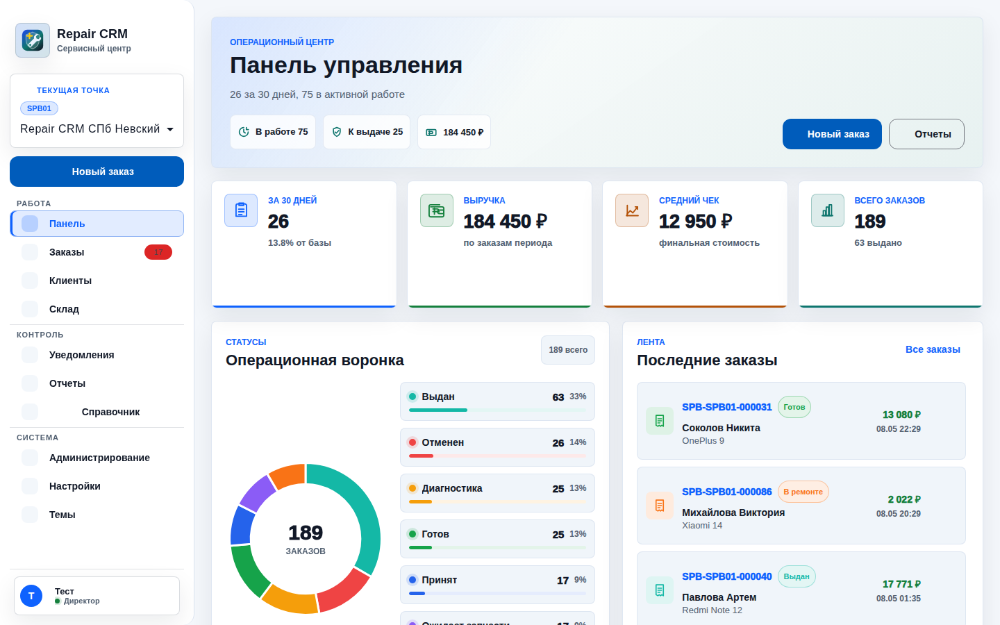
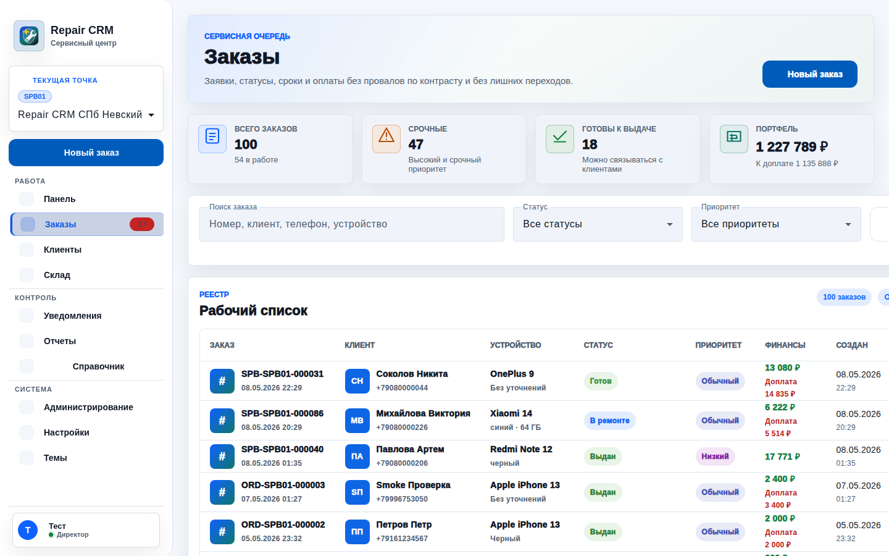
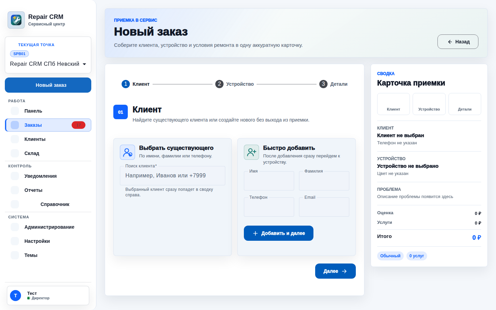
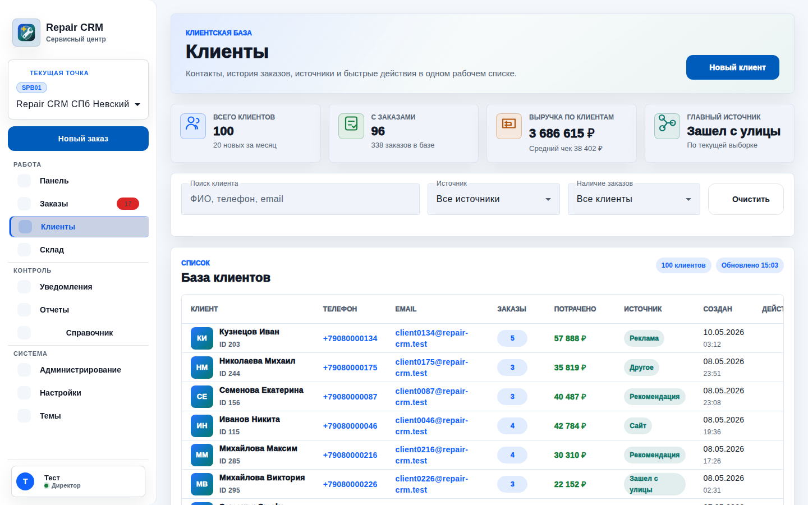
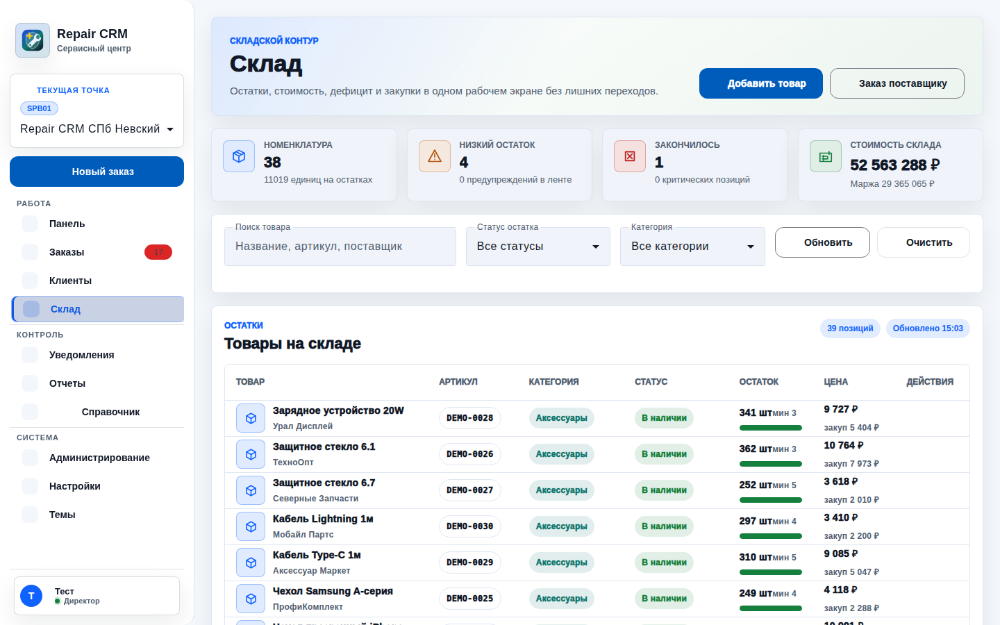
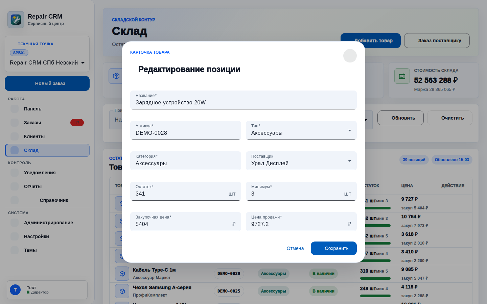
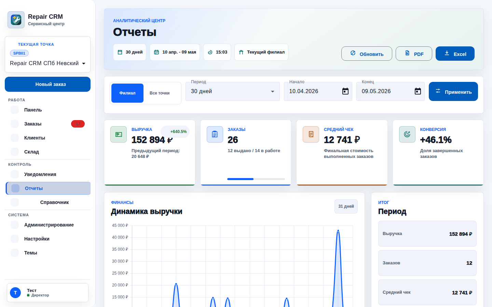
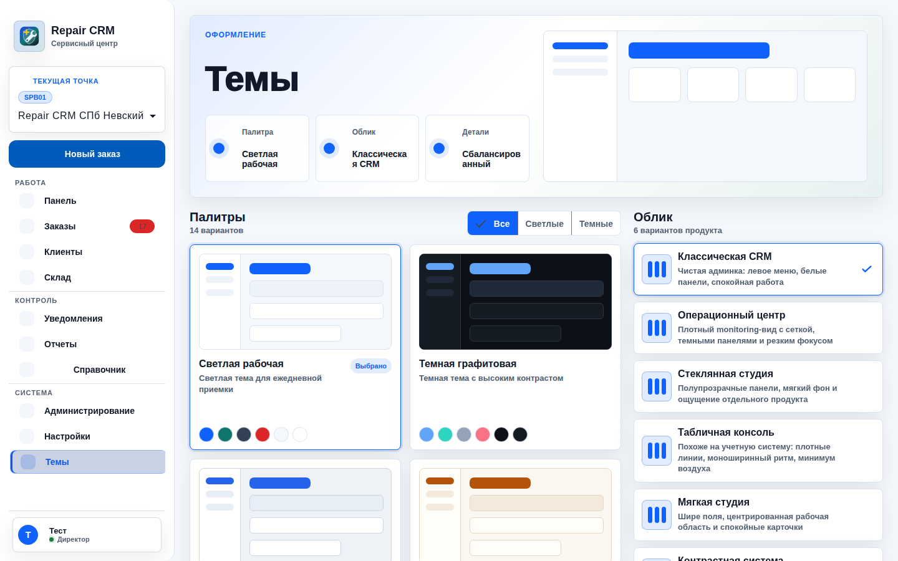
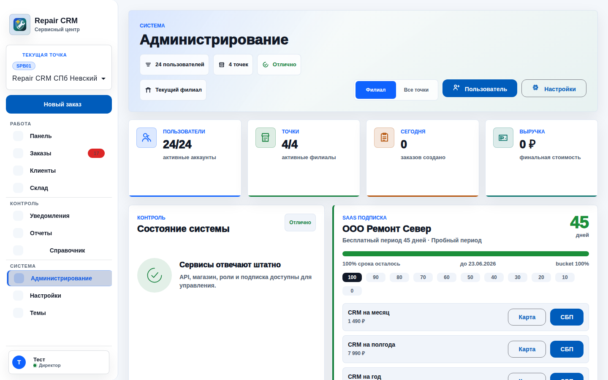

# Repair CRM

Repair CRM - CRM-система для сервисного центра и сети филиалов. Проект закрывает
приемку устройств, заказы на ремонт, клиентов, склад, закупки, уведомления,
отчеты, роли, права доступа, темы интерфейса и тестовые онлайн-платежи.

Репозиторий исторически называется `RepireCRM`, в интерфейсе используется бренд
`Repair CRM`.

## Скриншоты

Скриншоты сняты с локального демо-стенда с тестовыми данными.

### Панель управления



### Заказы



### Создание заказа



### Клиенты



### Склад



### Редактирование товара



### Отчеты



### Темы



### Администрирование



## Возможности

- Заказы на ремонт: создание, статусы, приоритеты, работы, услуги, выдача,
  финальная стоимость и история действий.
- Клиенты: база клиентов, карточка клиента, история заказов, быстрые действия.
- Склад: номенклатура, остатки, минимальные пороги, поставщики, закупки,
  корректировки и редактирование товара через модалку.
- Филиалы: сотрудник работает в выбранном магазине, данные заказов, склада и
  статистики ограничиваются текущим магазином.
- Директорский контур: директор и назначенные пользователи могут видеть общую
  статистику, управлять магазинами, ролями и доступами.
- Права доступа: русские названия permissions, настройка галочками в админке.
- Уведомления: события по заказам, складу и системным действиям.
- Отчеты: dashboard, аналитика по заказам, выручке, складу, прибыли и периодам.
- Темы: переключение визуального стиля, палитры, светлая и темная тема.
- Тестовые платежи: интеграция с тестовой ЮKassa для подписок и оплаты услуг.
- API smoke: скрипт, который проходит по live API и проверяет базовую
  работоспособность endpoints.
- Большие демо-данные: клиенты, заказы, склад и операции за год для проверки
  аналитики.

## Технологии

| Слой | Стек |
| --- | --- |
| Frontend | Angular 20, Angular Material, RxJS, NgRx, SCSS |
| Backend | Django, Django Ninja, JWT, Gunicorn для production |
| База данных | PostgreSQL |
| Очереди/кеш | Redis |
| Инфраструктура | Docker Compose, Makefile |
| Тесты | Django TestCase, Karma/ChromeHeadless, flake8, API smoke |
| Платежи | ЮKassa test/mock режим |

## Быстрый старт

### 1. Требования

- Docker и Docker Compose v2.
- `make`.
- Python 3 на хосте для `make smoke`.
- Node.js нужен только для локального Angular build вне контейнера. В dev-стенде
  frontend запускается в Docker.

### 2. Запуск dev-стенда

```bash
make up
```

После запуска:

- Frontend: <http://127.0.0.1:4200>
- Backend API: <http://127.0.0.1:8030/api>
- API docs: <http://127.0.0.1:8030/api/docs>
- Healthcheck: <http://127.0.0.1:8030/api/health>
- PostgreSQL: `127.0.0.1:55432`
- Redis: `127.0.0.1:56380`

Если порты заняты, их можно переопределить:

```bash
POSTGRES_PORT=55433 REDIS_PORT=56381 BACKEND_PORT=8031 FRONTEND_PORT=4201 make up
```

### 3. Создание демо-данных

```bash
make mock
```

Команда поднимет стенд, применит миграции и пересоздаст большую демо-базу:

- 12 месяцев данных;
- 720 заказов;
- 240 клиентов;
- склад, поставщики, закупки, платежи, роли и филиалы.

Тестовый пользователь после `make mock`:

```text
Логин:  b00bs
Пароль: QwsAzx@2000
```

Dev-суперпользователь из `docker-compose.dev.yml`:

```text
Логин:  admin
Пароль: admin123
```

### 4. Проверка стенда

```bash
make smoke
```

`make smoke` авторизуется тестовым пользователем и проверяет live API. Часть
endpoints с обязательными path-параметрами или зависимостью от специальных
demo-данных пропускается осознанно.

## Основные команды

```bash
make help             # показать все команды
make up               # запустить dev-стенд
make rebuild          # пересобрать и запустить dev-стенд
make down             # остановить контейнеры
make restart          # перезапустить контейнеры
make ps               # состояние контейнеров
make logs             # логи всех сервисов
make logs-backend     # логи backend
make logs-frontend    # логи frontend
```

Backend:

```bash
make migrate          # применить миграции
make makemigrations   # создать миграции
make shell            # Django shell
make dbshell          # Django dbshell
make superuser        # создать/обновить dev-суперпользователя
```

Frontend:

```bash
make npm CMD="install <package>"  # выполнить npm-команду в frontend-контейнере
make install                      # npm ci в frontend-контейнере
make build                        # Angular build в /tmp/repaircrm-angular-build
```

Демо-данные:

```bash
make mock             # большая demo-база за год
make mock-small       # быстрая маленькая demo-база
make reset-mock       # удалить demo-записи
make clean            # остановить стенд и удалить dev-volume'ы
```

Тесты и проверки:

```bash
make tests            # backend tests + frontend tests + lint + Angular build
make backend-tests    # только backend tests
make frontend-tests   # только frontend unit tests
make lint             # backend flake8
make smoke            # live API smoke
make client-sync      # ручной sync с внешним клиентским сервисом
```

## Структура проекта

```text
.
├── backend/                 # Django backend
│   ├── API/                 # admin/auth routers
│   ├── client_sync/         # интеграция с внешним клиентским сервисом
│   ├── core/                # настройки, API app, middleware
│   ├── customers/           # клиенты
│   ├── device/              # устройства и модели
│   ├── documents/           # документы и чеки
│   ├── finance/             # платежи, кассы, ЮKassa
│   ├── inventory/           # склад, поставщики, закупки
│   ├── notifications/       # уведомления
│   ├── orders/              # заказы и ремонт
│   ├── promotions/          # акции, скидки и промокоды
│   ├── reports/             # отчеты
│   ├── shops/               # филиалы, подписки, demo-data command
│   ├── tasks/               # задачи
│   ├── tests/               # backend tests
│   └── users/               # пользователи, роли, permissions
├── frontend/crm-app/        # Angular frontend
│   ├── src/app/components/  # страницы и компоненты
│   ├── src/app/services/    # API services
│   ├── src/app/store/       # NgRx store
│   └── src/styles.css       # глобальные стили и theme variables
├── docker/                  # Dockerfile'ы
├── docs/                    # документация и скриншоты
├── scripts/                 # утилиты, включая api_smoke.py
├── docker-compose.dev.yml   # dev-стенд
├── docker-compose.yml       # production compose
└── Makefile                 # основные команды разработки
```

## Работа с филиалами и доступами

Система рассчитана на сеть сервисных центров:

- у сотрудника есть доступные магазины;
- выбранный магазин передается в API через `X-Current-Shop`;
- заказы, склад, статистика и отчеты фильтруются по текущему магазину;
- директор и пользователи с нужными permissions могут видеть данные всех
  филиалов и общую статистику;
- роли и permissions редактируются в разделе `Администрирование`.

Ключевые группы permissions:

- заказы: просмотр, создание, редактирование, смена статуса, доступ ко всем
  филиалам;
- клиенты: просмотр, добавление, редактирование, удаление;
- склад: просмотр товаров, добавление, редактирование, остатки, движения,
  закупки, поставщики;
- отчеты: аналитика, экспорт, общая статистика;
- администрирование: магазины, сотрудники, роли и права;
- финансы: платежи, подписки, онлайн-оплата;
- маркетинг: просмотр акций, управление промокодами, применение скидок.

## API

Backend использует Django Ninja. Основные ссылки локального стенда:

- Swagger: <http://127.0.0.1:8030/api/docs>
- Root: <http://127.0.0.1:8030/api>
- Health: <http://127.0.0.1:8030/api/health>
- Client sync: `/api/client-sync/*`
- Акции и промокоды: `/api/promotions/*`

Авторизация:

```http
Authorization: Bearer <access_token>
X-Current-Shop: <shop_id>
```

Пример логина:

```bash
curl -X POST http://127.0.0.1:8030/api/auth/login \
  -H 'Content-Type: application/json' \
  -d '{"username":"b00bs","password":"QwsAzx@2000"}'
```

## Платежи и ЮKassa

В проекте есть тестовый контур онлайн-оплаты:

- оплата подписки магазина;
- оплата услуг по заказу после ремонта;
- поддержка тестового/mock режима ЮKassa;
- возможность использовать карту, СБП и другие способы на стороне провайдера.

Production env-переменные:

```text
YOOKASSA_SHOP_ID=
YOOKASSA_SECRET_KEY=
YOOKASSA_API_URL=https://api.yookassa.ru/v3
YOOKASSA_MOCK=false
YOOKASSA_CAPTURE=true
```

Для локальной разработки можно оставить mock/test настройки и не подключать
боевые ключи.

## Production

Production compose находится в `docker-compose.yml`. Подробный checklist:

- [docs/PRODUCTION.md](docs/PRODUCTION.md)

Минимальный запуск:

```bash
cp .env.production.example .env
# заполнить SECRET_KEY, POSTGRES_PASSWORD, ALLOWED_HOSTS и домены
docker compose --env-file .env -f docker-compose.yml up -d --build
```

Проверка:

```bash
curl http://localhost/api/health
docker compose -f docker-compose.yml ps
```

Перед публичным запуском обязательно:

- включить HTTPS на reverse proxy;
- задать сильные секреты;
- настроить backup PostgreSQL и media volume;
- подключить Sentry;
- настроить реальные SMS/Email-провайдеры;
- включить `SECURE_SSL_REDIRECT=True` и HSTS только после проверки HTTPS.

## Разработка

Типичный цикл:

```bash
make up
make mock
# разработка
make tests
make smoke
```

Если менялись модели:

```bash
make makemigrations
make migrate
make tests
```

Если менялся frontend:

```bash
make frontend-tests
make build
```

Если менялся backend API:

```bash
make backend-tests
make lint
make smoke
```

## Частые проблемы

### Порт занят

Переопределите порт при запуске:

```bash
FRONTEND_PORT=4201 BACKEND_PORT=8031 make up
```

### Нужно полностью пересоздать dev-базу

```bash
make clean
make mock
```

### Нет тестового пользователя

Создайте demo-data:

```bash
make mock
```

### API возвращает 403

Проверьте:

- есть ли JWT в `Authorization`;
- передан ли `X-Current-Shop`;
- есть ли у роли нужный permission;
- доступен ли выбранный магазин пользователю.

### Angular build пишет про Node path

`make build` использует переменную `NODE_PATH_BIN`. Если Node установлен в другом
месте, передайте свой путь:

```bash
NODE_PATH_BIN=/path/to/node/bin make build
```

## Безопасность

- Не коммитьте боевые ключи, токены, production `.env` и реальные данные
  клиентов.
- Демо-пароли подходят только для локального стенда.
- Для production используйте сильный `SECRET_KEY`, отдельный пароль БД,
  HTTPS-only cookies и регулярные backup'ы.
